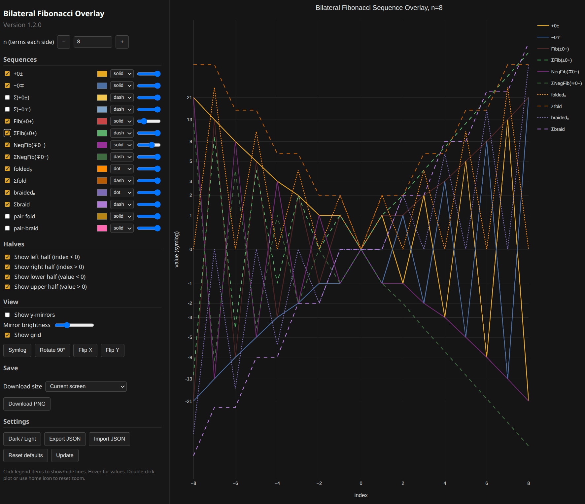

# bilateral-fibonacci
Interactive browser tool for exploring the bilateral Fibonacci sequence and its derived cumulative, folded, braided, pair‑fold, and pair‑braid forms.

## Live version
Open the tool here:

[https://confuter.github.io/bilateral-fibonacci/interactive_bilateral_fibonacci.html](https://confuter.github.io/bilateral-fibonacci/interactive_bilateral_fibonacci.html)



## Open
Download or clone the repository, then open:

```text
interactive_bilateral_fibonacci.html
```

No server or build step is required. The page uses the Plotly CDN, so an internet connection is needed.

Current version: 1.2.0
## Features

- Change the number of terms `n` on each side of zero with input or `+` / `−` buttons
- Keep `x=0` and `y=0` centred when changing `n`
- Show or hide individual sequences
- Show or hide the left, right, upper, and lower halves of the graph
- Show mirrored values for every sequence
- Adjust mirror brightness
- Rotate the graph through 0°, 90°, 180°, and 270°
- Flip the x-axis or y-axis
- Toggle linear and symlog views
- Toggle dark and light backgrounds
- Toggle grid visibility
- Change each sequence colour, line style, and opacity
- Export and import configuration as JSON
- Download the current view as PNG in several sizes, including current screen
- Reset all settings to defaults
- Settings persist automatically across page refreshes
- Zoom, pan, and reset the view

## Sequences

The tool includes the following named sequences:

- `+0±`
- `−0∓`
- `Σ(+0±)`
- `Σ(−0∓)`
- `Fib(±0+)`
- `ΣFib(±0+)`
- `NegFib(∓0−)`
- `ΣNegFib(∓0−)`
- `folded₀`
- `Σfold`
- `braided₀`
- `Σbraid`
- `pair-fold`
- `pair-braid`

`Σ` denotes the cumulative sum of a sequence.

## Notes
- Settings are saved automatically in the browser using `localStorage`.
- Use **Export JSON** to save a copy of the current configuration.
- Use **Import JSON** to load a saved configuration.
- Double-click the graph or use the home icon in the Plotly toolbar to reset zoom.


## Related
- Substack article:  
*Confuting Fibonacci: Fibonacci 0+ Is Only a Fragment of the Bilateral Sequence* [https://confuter.substack.com/p/fibonacci](https://confuter.substack.com/p/fibonacci)

- Scientific paper:  
*The Bilateral Fibonacci: Restoring the Negafibonacci and the Alternating View of Numbers* [https://doi.org/10.5281/zenodo.22215140](https://doi.org/10.5281/zenodo.22215140)


## License
[CC BY 4.0](https://creativecommons.org/licenses/by/4.0/)

